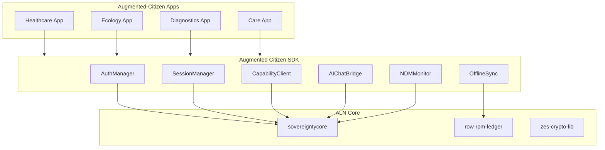

# Augmented Citizen SDK Architecture

## Overview

`augmented-citizen-sdk` is the **Application Development Layer** of the Sovereign Spine, providing multi-language SDKs for building Augmented-Citizen applications with built-in sovereignty.

## Architecture Diagram



## Key Design Principles

1. **Built-in Sovereignty** - All apps inherit ALN security by default
2. **Passwordless Auth** - Bostrom DID cryptographic authentication
3. **NDM-Aware** - Session privileges scale with NDM scores
4. **Offline-First** - Apps work without network connectivity
5. **Multi-Language** - Rust, JS, Kotlin, Mojo support

## Session States

| State | NDM Range | Capabilities |
|-------|-----------|--------------|
| Active | 0.0-0.3 | Full access |
| Monitoring | 0.3-0.6 | Read + Write |
| ObserveOnly | 0.6-0.8 | Read only |
| Frozen | 0.8-1.0 | None |

## Security Properties

- **DID-Anchored** - All users authenticated via Bostrom DID
- **NDM-Gated** - Privileges respect NDM scores
- **Zes-Encrypted** - All communications quantum-safe
- **Ledger-Logged** - All actions logged to ROW/RPM
- **Offline-Capable** - Works without network connectivity

## Supported Use Cases

| Use Case | SDK Components | Sovereignty Features |
|----------|----------------|---------------------|
| Healthcare | Auth, Session, Cap | Patient privacy, NDM monitoring |
| Ecology | Auth, Session, Offline | Swarm mission requests, offline sync |
| Diagnostics | Auth, NDM, Cap | System diagnostics, capability gating |
| AI-Chat | AIChatBridge, NDM | Sovereignty flags, rate limiting |

---

**Document Hex-Stamp:** `0x8b9c0d1e2f3a4b5c6d7e8f9a0b1c2d3e4f5a6b7c8d9e0f1a2b3c4d5e6f7a8b9c`  
**Last Updated:** 2026-03-04
```
